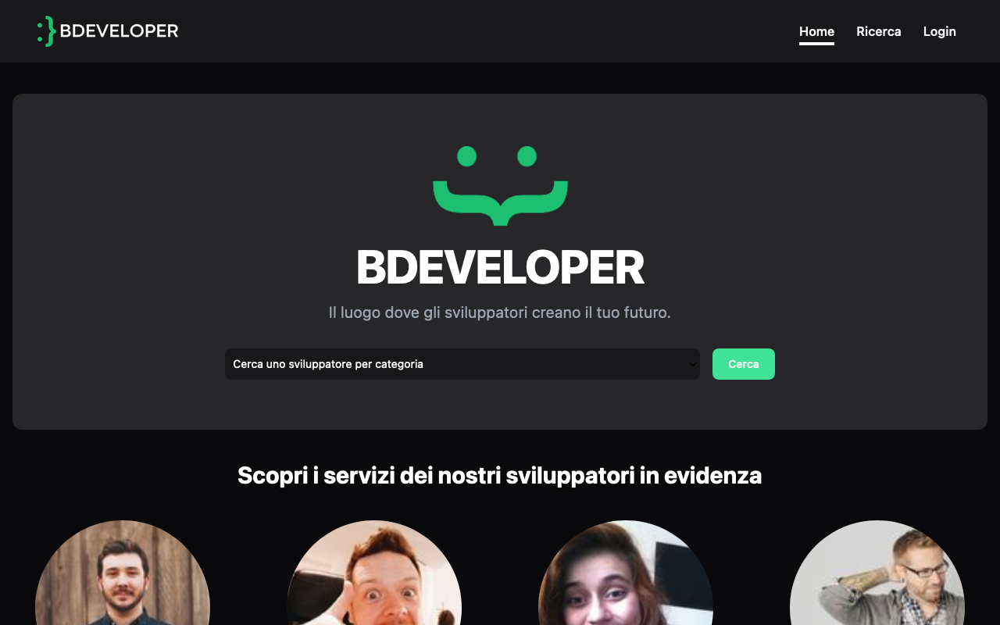

# BDeveloper

Questo è BDeveloper, ovvero un sito che permette di cercare uno sviluppatore specializzato in un determinato ambito e chiedere un appuntamento. 

Gli sviluppatori hanno invece la possibilità di:
- Registrarsi e gestire i dati del proprio profilo,
- Vedere i messaggi ricevuti,
- Vedere le recensioni rilasciate su di lui,
- Vedere le proprie statistiche di andamento,
- Sottoscrivere un abbonamento per aumentare la visibilità del proprio profilo.

Fork del [progetto originale](https://github.com/FraFra2/bdevelopers-fe) con lo scopo di implementare miglioramenti.

Front-Office: [final-project-fo](https://github.com/matteobonesini/final-project-fo)

Back-Office: [final-progect-bo](https://github.com/matteobonesini/final-project-bo)